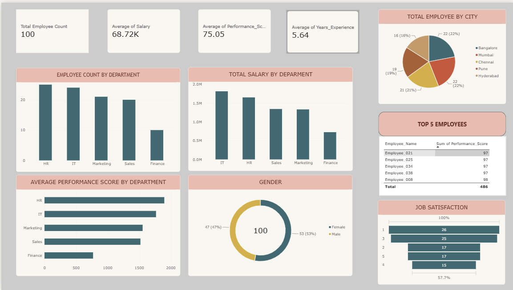

# Employee Performance & HR Analytics Dashboard

## 📊 Project Overview

An interactive Power BI dashboard developed to analyze employee performance and HR-related data.

The dashboard provides insights into employee demographics, salary, experience, performance, job satisfaction, department-wise workforce distribution, and top-performing employees.

## 🛠️ Tools & Technologies

- Power BI
- Power Query
- DAX
- CSV

## 📌 Dashboard Features

- Total Employee Count
- Average Salary
- Average Performance Score
- Average Years of Experience
- Employees by Department
- Salary Analysis by Department
- Performance Analysis by Department
- Gender Distribution
- City-wise Employee Analysis
- Top 5 Performing Employees
- Job Satisfaction Analysis

## 📂 Dataset

The dataset contains employee information including:

- Employee ID
- Employee Name
- Age
- Gender
- Department
- City
- Years of Experience
- Salary
- Performance Score
- Job Satisfaction

## 🖼️ Dashboard Preview

## 🎯 Objective

The objective of this project is to use Power BI to transform employee data into meaningful visual insights that can support HR analytics and decision-making.

## 📁 Project Files

- `Employee-HR-Analytics-PowerBI.pbix` — Power BI dashboard file
- `PowerBI_Employee_HR_Analytics_Dataset.csv` — Dataset used for analysis
- `Dashboard.png` — Dashboard preview
